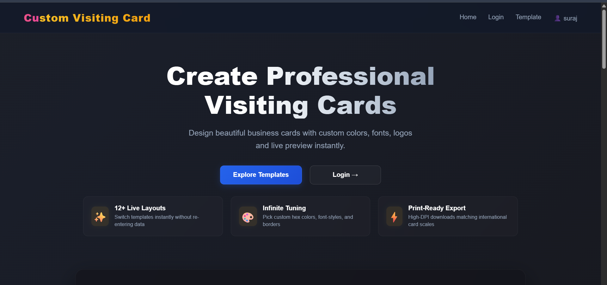
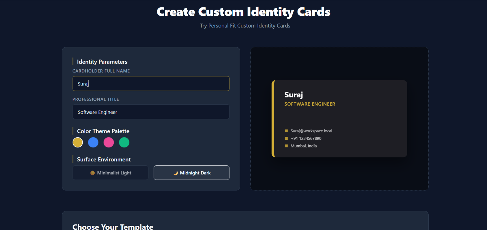
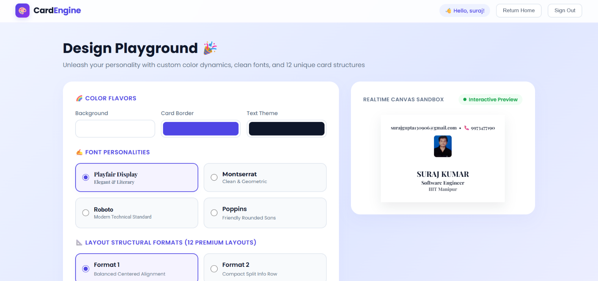
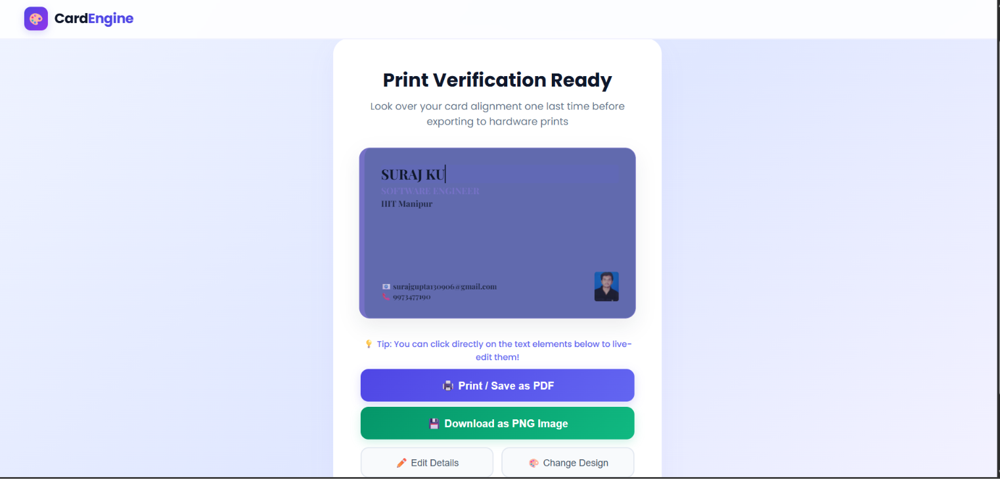
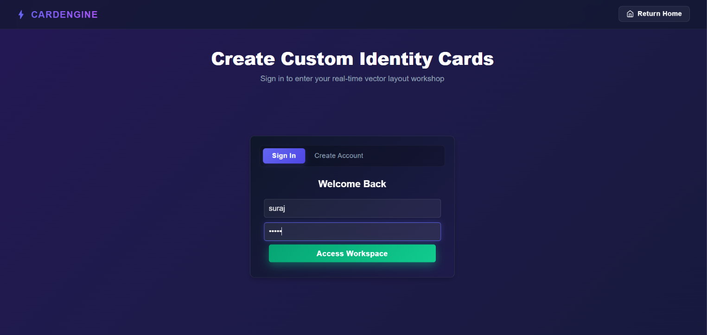

# CardEngine

A modern web application for creating, customizing, previewing, and
downloading professional digital visiting cards.

## 📸 Screenshots

### Homepage



### Card Details



### Design Playground



### Print Preview



### Login



##  Features

- Multiple premium card layouts
- Custom card information
- Profile image and logo support
- Color customization
- Border customization
- Background customization
- Image positioning
- Real-time card preview
- High-resolution card download
- User registration and login interface
- LocalStorage-based data persistence
- SessionStorage-based current-user management
- Responsive interface

##  Tech Stack

- HTML5
- CSS3
- JavaScript (ES6+)
- LocalStorage
- SessionStorage

##  Project Structure

```text
CardEngine/
├── css/
├── js/
├── assets/
├── screenshots/
├── index.html
├── login.html
├── register.html
├── dashboard.html
├── editor.html
└── preview.html